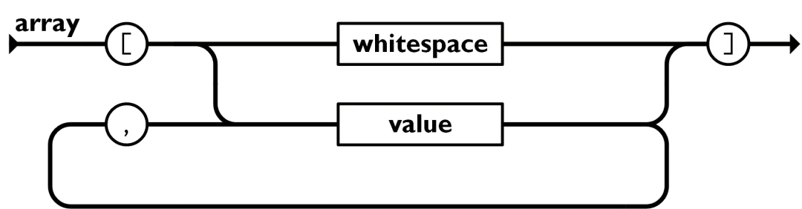
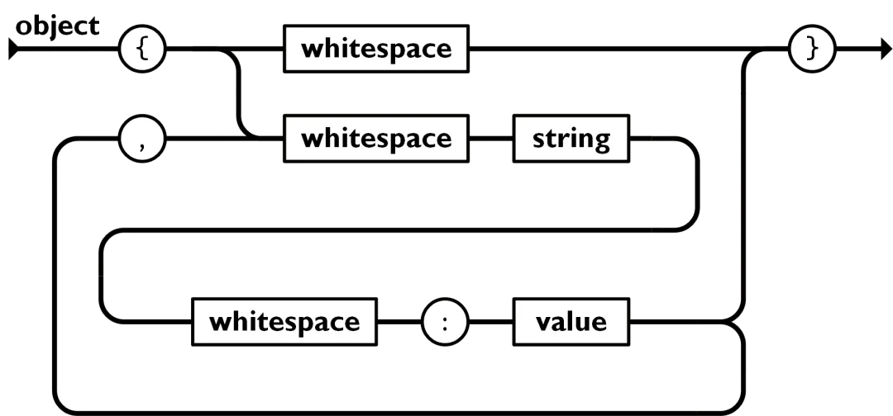

# jsoncpp

A library for reading json in cpp implemented personally.

json example:

JSON: JavaScript Object Notation

[JSON标准文档](https://www.json.org/json-zh.html)

```JSON
{
    "title": "Design Patterns",
    "subtitle": "Elements of Reusable Object-Oriented Software",
    "author": [
        "Erich Gamma",
        "Richard Helm",
        "Ralph Johnson",
        "John Vlissides"
    ],
    "year": 2009,
    "weight": 1.8,
    "hardcover": true,
    "publisher": {
        "Company": "Pearson Education",
        "Country": "India"
    },
    "website": null
}
```

json是一个树状结构，包括六种类型：


* null:表示空值
* bool:布尔型，有true和false
* number:数字型，通常浮点数表示
* string:字符串型
* array:数组结构，用`[]`表示，里面只包含value而没有key

* object:对象，用`{}`表示，里面可以嵌套包含json结构


但是json不能写注释。

---

实现json库需要满足的需求

* 将json转换为树状结构。(parse)
* 提供接口访问数据结构。(access)
* 把数据结构转换为JSON文本。(stringify)

关于json库，我要实现哪些功能？怎么实现？

- [X] 一个数据类，用于存储json的数据结构
- [X] 一个能够读取json文件的函数
- [X] 需要能够对json包含的键值增删改查
- [X] 需要有一个将json类导出为json文件的函数
- [ ] 需要有一个json语法检查器

构造函数和析构函数：

```cpp
    // 构造函数与析构函数
    Json();
    ~Json();
    // 文件读取与保存
    void ReadFile(std::string filename);
    void SaveFile(std::string filename);
    void PrintRowjson();
    // 解析，保存到Json类中数据结构
    void Build(std::string s = "");
    // 对存储数据增删改查
    void PrintJson();
    void ShowKeys();
    void DeleteKey(std::string keyname);
    void SearchKey(std::string keyname);
    void InsertKey(std::string keyname, std::string value);
    void RewriteKey(std::string keyname, std::string value);

    数据访问函数，运算符重载。
    ptr_jsonValue operator[](std::string key);
```

重载函数只实现了第一层，因为不知道怎么处理后续的重载符号了。

测试驱动开发test-driven development, TDD

1. 加入一个测试。
2. 运行所有测试，新的测试应该会失败。
3. 编写实现代码。
4. 运行所有测试，若有测试失败回到3。
5. 重构代码。
6. 回到 1。

