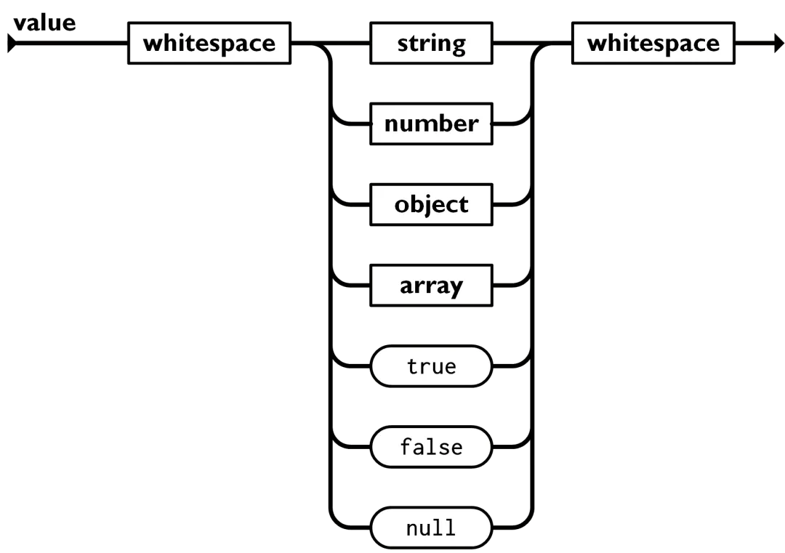

# jsoncpp

A library for reading json in cpp implemented personally.

json example:

JSON: JavaScript Object Notation

[JSON标准文档](https://www.json.org/json-zh.html)

```JSON
{
    "title": "Design Patterns",
    "subtitle": "Elements of Reusable Object-Oriented Software",
    "author": [
        "Erich Gamma",
        "Richard Helm",
        "Ralph Johnson",
        "John Vlissides"
    ],
    "year": 2009,
    "weight": 1.8,
    "hardcover": true,
    "publisher": {
        "Company": "Pearson Education",
        "Country": "India"
    },
    "website": null
}
```

json是一个树状结构，包括六种类型：


* null:表示空值
* bool:布尔型，有true和false
* number:数字型，通常浮点数表示
* string:字符串型
* array:数组结构，用`[]`表示，里面只包含value而没有key

* object:对象，用`{}`表示，里面可以嵌套包含json结构


但是json不能写注释。

---

实现json库需要满足的需求

* 将json转换为树状结构。(parse)
* 提供接口访问数据结构。(access)
* 把数据结构转换为JSON文本。(stringify)

关于json库，我要实现哪些功能？怎么实现？

* 一个数据类，用于存储json的数据结构
* 一个能够读取json文件的函数
* 需要能够对json包含的键值增删改查
* 需要有一个将json类导出为json文件的函数
构造函数和析构函数：

已声明：json() 和 ~json()
复制构造函数和赋值运算符：

json(const json& other);
json& operator=(const json& other);
类型判断和获取函数：

jsonType getType() const;
bool isNull() const;
bool isBoolean() const;
bool isNumber() const;
bool isString() const;
bool isArray() const;
bool isObject() const;

数据访问函数：

bool asBool() const;
double asNumber() const;
const std::string& asString() const;
const json& operator[](size_t index) const; // 数组访问
const json& operator[](const std::string& key) const; // 对象访问

数据修改函数：

void setBool(bool value);
void setNumber(double value);
void setString(const std::string& value);
void setArray();
void setObject();
json& operator[](size_t index); // 数组访问
json& operator[](const std::string& key); // 对象访问

数组和对象的元素操作函数：

void append(const json& value); // 数组追加元素
void remove(size_t index); // 移除数组元素
void remove(const std::string& key); // 移除对象键值对
size_t size() const; // 返回数组或对象的大小

序列化和反序列化函数：

std::string serialize() const;
static json deserialize(const std::string& jsonString);

测试驱动开发test-driven development, TDD

1. 加入一个测试。
2. 运行所有测试，新的测试应该会失败。
3. 编写实现代码。
4. 运行所有测试，若有测试失败回到3。
5. 重构代码。
6. 回到 1。


为了避免在头文件中包含 `<memory>`，你可以使用前向声明和智能指针的特化声明，但不幸的是，标准库的智能指针类型（如 std::unique_ptr 和 std::shared_ptr）需要在头文件中包含 `<memory>`，因为模板实例化需要完整的类型定义。

不过，可以通过将实现细节隐藏在实现文件中，尽量减少头文件的包含来优化依赖。

一个更好的方案是使用一个私有实现类（Pimpl Idiom），这样可以完全隐藏实现细节，并减少头文件中的包含。这种设计模式称为 "Pimpl Idiom"（Pointer to Implementation Idiom）。

测试框架 test framework  github：catch

断言（assertion）是 C 语言中常用的防御式编程方式，减少编程错误。最常用的是在函数开始的地方，检测所有参数。有时候也可以在调用函数后，检查上下文是否正确。C 语言的标准库含有 assert() 这个宏（需 #include ），提供断言功能。当程序以 release 配置编译时（定义了 NDEBUG 宏），assert() 不会做检测；而当在 debug 配置时（没定义 NDEBUG 宏），则会在运行时检测 assert(cond) 中的条件是否为真（非 0），断言失败会直接令程序崩溃。